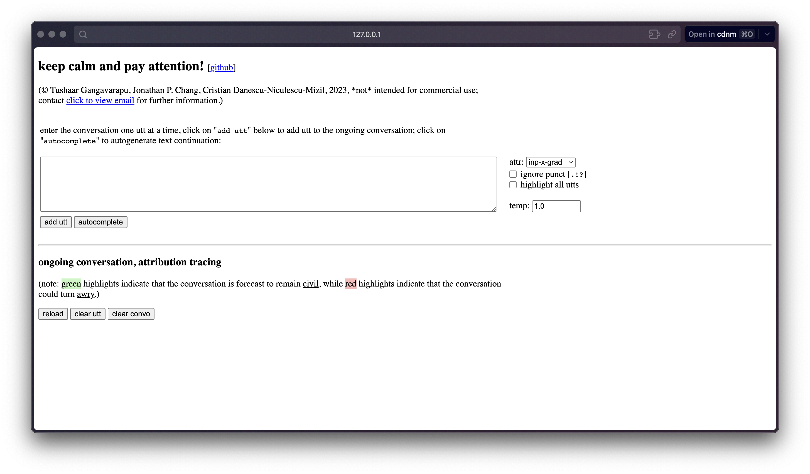

# convo-wizard visualization

To be able to run the app locally, you need to both install this package and have the pretrained model, tokenizer files.
To install this package, run:

```shell
git clone https://github.com/CornellNLP/craft-experiments.git
cd $HOME/craft-experiments

# create a venv 'craft' in craft-experiments dir.
python3 -m venv craft
source ./craft/bin/activate

# install the needed requirements and setup the package.
pip3 install -r requirements.txt
python3 setup.py install
```

Once you’ve successfully run the above commands [= package is successfully installed], download the model and tokenizer
files (contact the author for these files if you don't have them already) and unzip them to find a `model.pt` file
and a `tokenizer` folder; note the paths to these two artefacts. Now, run the following:

```shell
cd $HOME/craft-experiments
python visualization/app.py \
  --tokenizer_path=<path-to-tokenizer-folder> \
  --pretrained_model_path=<path-to-model-pt> \
  --config_path='./scripts/modeling/configs/convo_wizard.yml' \
  --port=5000
```

Once the above command runs, you should be able to access the app at: http://127.0.0.1:5000; the app should look like:
